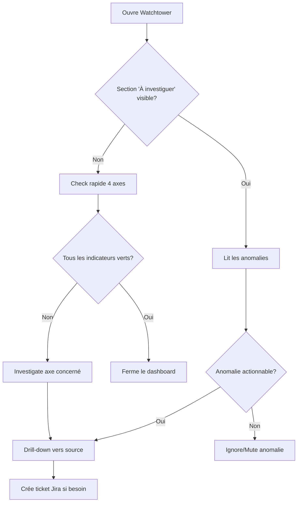
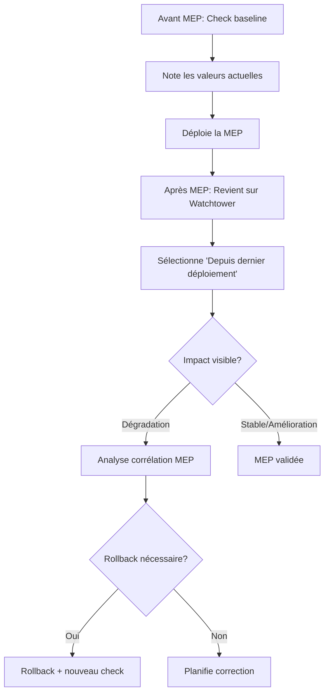
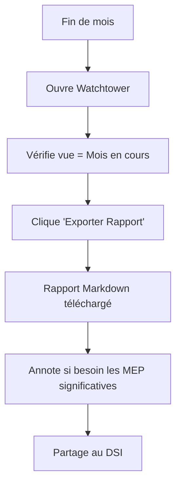

# UX Design Specification platform-monitoring

**Author:** JG
**Date:** 2026-03-09

---

## Executive Summary

### Project Vision

Watchtower est un dashboard de monitoring centralisé qui unifie la santé des plateformes Wamiz (International, Pet-Gen, Pet Avatar) en un seul endroit. Il remplace la consultation fragmentée de 10+ outils et automatise la préparation des rapports mensuels actuellement réalisés via captures d'écran manuelles.

### Target Users

- **Tech Lead** : Usage hebdomadaire avec drill-down ponctuel. Besoin de décider quoi prioriser et générer les rapports mensuels en 1 clic.
- **Développeurs** : Usage ponctuel avant/après déploiements. Besoin de visibilité rapide sur la santé du repo sans jongler entre outils.
- **DSI** : Usage mensuel pour consultation du rapport généré. Besoin de rapport prêt à présenter avec ROI des actions correctives visible.

### Key Design Challenges

1. **Visualisation multi-sources** : Afficher les données de 10+ outils sans surcharger l'interface
2. **Corrélation MEP → Impact** : Overlay des déploiements sur les courbes de métriques de façon lisible
3. **Anomalies actionnables** : Section "À investiguer" qui aide à décider, pas qui génère du bruit
4. **Hiérarchie d'information** : Progression claire de la vue globale vers le détail

### Design Opportunities

1. **Section "À investiguer"** : Différenciateur clé vs dashboards classiques — détection automatique de ce qui mérite attention
2. **Timeline des MEP** : Preuve visuelle de l'impact des déploiements, répondant au besoin de corrélation
3. **Rapport mensuel 1-clic** : Moment "aha!" qui élimine les heures de captures d'écran manuelles

## Core User Experience

### Defining Experience

L'expérience core de Watchtower repose sur une action fondamentale : ouvrir le dashboard et **voir immédiatement ce qui nécessite attention** sans avoir à chercher. L'utilisateur doit pouvoir identifier les priorités en moins de 30 secondes.

### Platform Strategy

- **Plateforme** : Application web (Nuxt UI hébergé sur Cloudflare)
- **Devices** : Desktop uniquement — pas de responsive mobile
- **Input** : Souris et clavier
- **Mode visuel** : Dark mode natif
- **Connectivité** : Online uniquement, pas de mode offline

### Effortless Interactions

1. **Check rapide** : Vue synthétique des 4 axes avec indicateurs visuels (vert/orange/rouge) permettant un diagnostic instantané
2. **Corrélation MEP visible** : Overlay automatique des déploiements sur les courbes de métriques — l'utilisateur n'a pas à chercher les corrélations
3. **Drill-down fluide** : Un clic ouvre l'outil source (Sentry, DebugBear, etc.) dans un nouvel onglet
4. **Rapport 1-clic** : Export Markdown complet avec comparaison M/M-1 sans configuration

### Critical Success Moments

- **Premier accès** : L'utilisateur voit immédiatement l'état de santé global, pas une page de configuration ou d'onboarding
- **Détection d'anomalie** : La section "À investiguer" présente des éléments actionnables, pas une liste de faux positifs
- **Corrélation MEP → Impact** : En survolant un marqueur de déploiement, l'utilisateur visualise l'impact sur les métriques adjacentes
- **Génération rapport** : Un clic produit un rapport Markdown prêt à partager

### Experience Principles

1. **Proactif** : Le dashboard indique ce qui est important, il ne se contente pas d'afficher des chiffres
2. **Zéro configuration** : Fonctionnel dès l'ouverture, aucun setup utilisateur requis
3. **Drill-down, pas duplication** : Watchtower agrège et pointe vers les sources, il ne remplace pas les outils existants
4. **Comparaison native** : La vue M vs M-1 est toujours présente, pas une option cachée

## Desired Emotional Response

### Primary Emotional Goals

**Confiance et contrôle** : L'utilisateur sait exactement ce qui se passe sur les plateformes sans stress ni surcharge cognitive. Il se sent informé et capable de prendre des décisions éclairées rapidement.

### Emotional Journey Mapping

| Phase | Émotion cible | Ce qui la crée |
|-------|---------------|----------------|
| Ouverture | Soulagement, clarté | Vue synthétique immédiate des 4 axes |
| Détection anomalie | Alerte sereine | Ton informatif ("À investiguer"), pas alarmiste |
| Investigation | Satisfaction de comprendre | Corrélation MEP visible, drill-down fluide |
| Rapport généré | Accomplissement | Export 1-clic, travail valorisé |
| Usage quotidien | Routine efficace | Interface prévisible et rapide |

### Micro-Emotions

- **Confiance vs Confusion** : Critique — chaque donnée doit être claire et sourcée
- **Maîtrise vs Submersion** : Critique — la hiérarchie visuelle doit filtrer le bruit
- **Accomplissement vs Frustration** : Important — le rapport doit être complet du premier coup

### Design Implications

- **Ton visuel calme** : Dark mode, éviter les rouges agressifs et les animations alarmistes
- **Langage positif** : "À investiguer" plutôt que "ALERTE CRITIQUE"
- **Transparence** : Liens vers les sources pour chaque donnée, l'utilisateur peut vérifier
- **Prévisibilité** : Navigation cohérente, même structure sur tous les écrans

### Emotional Design Principles

1. **Informer, pas alarmer** : Le dashboard aide à comprendre, il ne génère pas de stress
2. **Récompenser l'efficacité** : Chaque action rapide est une petite victoire
3. **Respecter l'expertise** : L'utilisateur est tech, on lui donne des données, pas des conseils condescendants

## UX Pattern Analysis & Inspiration

### Inspiring Products Analysis

**Datadog** : Référence pour la corrélation temporelle multi-métriques et l'overlay des déploiements. À éviter : complexité de configuration.

**Sentry** : Modèle pour la priorisation automatique des issues et le regroupement intelligent. Pattern "Issues to investigate" directement applicable.

**Linear** : Référence pour l'interface épurée dark mode et la navigation ultra-rapide. Inspiration pour le ton visuel sobre et efficace.

**Grafana** : Modèle pour le time range selector et la composition de vues. À éviter : courbe d'apprentissage élevée.

### Transferable UX Patterns

- **Time Range Selector** (Grafana) : Semaine / Mois / Année / Depuis dernier déploiement / Custom
- **Repo Switcher** (GitHub-style) : Toggle rapide entre International / Pet-Gen / Pet Avatar / Tous
- **Deployment Markers** (Datadog) : Overlay des MEP sur les courbes avec tooltip détaillé
- **Issue Triage** (Sentry) : Section "À investiguer" avec priorisation automatique
- **Minimal Dark UI** (Linear) : Interface sobre où les données sont au premier plan

### Anti-Patterns to Avoid

- **Dashboard Builder Syndrome** : Pas de configuration utilisateur — vues préconfigurées uniquement
- **Alert Fatigue** : Section "À investiguer" filtrée, pas de notifications push agressives
- **Metric Overload** : 4 axes structurés, pas 20 graphes sur une page
- **Deep Nesting** : Maximum 2 niveaux de navigation (Dashboard → Drill-down source)

### Design Inspiration Strategy

**Adopter :**
- Time range selector façon Grafana pour la flexibilité temporelle
- Priorisation automatique façon Sentry pour "À investiguer"
- Deployment markers façon Datadog pour corrélation MEP

**Adapter :**
- Dark mode Linear mais avec indicateurs couleur (vert/orange/rouge) pour les axes
- Navigation Grafana simplifiée sans personnalisation

**Éviter :**
- Complexité Datadog — Watchtower doit être lisible en 30 secondes
- Customisation Grafana — pas de dashboard builder, vues fixes

## Design System Foundation

### Design System Choice

**Nuxt UI 4.5** — Framework de composants officiel pour Nuxt 3, basé sur Tailwind CSS.

### Rationale for Selection

1. **Alignement stack** : Nuxt UI est le choix naturel pour une app Nuxt 3 hébergée sur Cloudflare
2. **Dark mode natif** : Support intégré du dark mode, cohérent avec nos objectifs visuels
3. **Composants riches** : Tables, cards, modals, dropdowns — tout ce qu'il faut pour un dashboard
4. **Tailwind CSS** : Personnalisation facile via design tokens
5. **Maintenance réduite** : Pas de design system custom à maintenir

### Implementation Approach

**Principe clé : Maximiser l'utilisation des composants Nuxt UI 4.5 existants.**

- Utiliser les composants Nuxt UI par défaut sans modification (UButton, UCard, UTable, UDropdown, UBadge, UAlert, etc.)
- Personnaliser uniquement via `app.config.ts` pour les couleurs et tokens
- Éviter de créer des composants custom si un composant Nuxt UI peut faire le travail
- Composer les primitives Nuxt UI pour les besoins métier spécifiques

### Design Approach

**Pas de maquettes Figma** — L'interface sera construite directement en code en utilisant les composants Nuxt UI 4.5. La documentation Nuxt UI et cette spécification UX servent de référence design.

### Customization Strategy

| Aspect | Approche |
|--------|----------|
| **Couleurs** | Étendre la palette Tailwind avec les couleurs sémantiques (success, warning, danger) |
| **Typographie** | Utiliser la stack système par défaut (Inter, system-ui) |
| **Spacing** | Garder l'échelle Tailwind standard (4px base) |
| **Composants** | Utiliser Nuxt UI 4.5 tel quel, composer si nécessaire |

## Core Interaction Definition

### Defining Experience

**"Voir la santé plateforme en un coup d'œil, agir en 30 secondes"**

L'utilisateur ouvre Watchtower → voit les 4 axes + "À investiguer" → sait quoi faire → optionnellement drill-down ou génère le rapport.

### User Mental Model

Les utilisateurs sont des techs habitués aux dashboards (Sentry, Datadog, Grafana). Ils s'attendent à :
- Des graphes temporels avec des courbes
- Des indicateurs de statut (vert/orange/rouge)
- Des liens vers les sources
- Un sélecteur de période

### Success Criteria

| Critère | Cible |
|---------|-------|
| Temps pour identifier un problème | < 30 secondes |
| Clics pour générer un rapport | 1 |
| Clics pour drill-down vers source | 1 |
| Temps de chargement initial | < 2 secondes |

### Experience Mechanics

**Initiation :**
- L'utilisateur arrive sur le dashboard → vue par défaut = Mois en cours vs M-1
- Section "À investiguer" visible en haut si anomalies détectées

**Interaction :**
- Survol d'un graphe → tooltip avec valeurs précises
- Survol d'un marqueur MEP → tooltip avec détails du déploiement
- Clic sur un élément "À investiguer" → expand avec contexte

**Feedback :**
- Indicateurs couleur instantanés (vert/orange/rouge)
- Deltas visuels (+X%, -Y%) avec flèches directionnelles
- États de chargement avec skeletons

**Completion :**
- Rapport généré → notification de succès + téléchargement automatique
- Drill-down → nouvel onglet vers l'outil source

## Visual Design Foundation

### Color System

**Palette sémantique (dark mode) :**

| Token | Couleur | Usage |
|-------|---------|-------|
| `primary` | Blue 500 | Actions principales, liens |
| `success` | Green 500 | Métriques saines, amélioration |
| `warning` | Amber 500 | Métriques à surveiller |
| `danger` | Red 500 | Métriques critiques, dégradation |
| `neutral` | Slate | Backgrounds, textes |

**Indicateurs d'axes :**
- 🔴 Stabilité : `danger` pour erreurs, `success` pour résolutions
- ⚡ Performance : Seuils Google (LCP < 2.5s = success, > 4s = danger)
- 🔒 Sécurité : Sévérité Dependabot (critical = danger)
- ✅ Qualité : Coverage (> 80% = success, < 60% = warning)

### Typography System

- **Font family** : `Inter, system-ui, sans-serif` (stack Nuxt UI par défaut)
- **Headings** : Semi-bold, tailles 2xl/xl/lg
- **Body** : Regular, taille base (16px)
- **Data** : Tabular nums pour les métriques (alignement)
- **Code** : Monospace pour les valeurs techniques

### Spacing & Layout Foundation

- **Base unit** : 4px (Tailwind default)
- **Grid** : 12 colonnes, max-width 1440px
- **Density** : Medium — ni trop aéré ni trop dense
- **Card padding** : 16px (p-4)
- **Section spacing** : 24px (space-y-6)

### Layout Structure

```
┌─────────────────────────────────────────────────────────────────┐
│ Header: Logo | Repo Selector | Time Range | Export              │
├─────────────────────────────────────────────────────────────────┤
│ Alert Banner: "À investiguer" (X éléments)           [voir tout]│
├─────────────────────────────────────────────────────────────────┤
│ Summary Cards: 4 axes (Stabilité | Perf | Sécu | Qualité)       │
├─────────────────────────────────────────────────────────────────┤
│ Timeline Chart: Graphe principal avec MEP markers               │
├─────────────────────────────────────────────────────────────────┤
│ Detail Sections: Chaque axe expandable                          │
└─────────────────────────────────────────────────────────────────┘
```

## User Journey Flows

### Journey 1: Weekly Health Check (Tech Lead)



### Journey 2: Pre/Post MEP Check (Dev)



### Journey 3: Monthly Report Generation



### Journey Patterns

- **Entry point unique** : Dashboard principal, pas de navigation complexe
- **Progressive disclosure** : Summary → Détail → Source externe
- **Actions contextuelles** : Drill-down et export accessibles depuis chaque section

## Component Strategy

### Principe : Nuxt UI 4.5 First

**Règle d'or** : Utiliser les composants Nuxt UI 4.5 existants au maximum. Ne créer un composant custom que si aucun composant Nuxt UI ne peut répondre au besoin.

### Nuxt UI 4.5 Components (Built-in)

| Composant | Usage Watchtower |
|-----------|------------------|
| `UCard` | Containers pour chaque axe et section |
| `UButton` | Actions (Export, Drill-down) |
| `UDropdownMenu` | Repo selector, Time range selector |
| `USelectMenu` | Sélecteurs avec recherche si besoin |
| `UTable` | Liste des anomalies, détails erreurs (prop `data` pour les rows) |
| `UBadge` | Indicateurs de statut (severity, delta) |
| `UAlert` | Bannière "À investiguer" |
| `UTooltip` | Détails au survol |
| `USkeleton` | États de chargement |
| `UIcon` | Icônes des axes et actions |
| `USeparator` | Séparation des sections |
| `UContainer` | Layout principal |

### Compositions (assemblage de composants Nuxt UI)

Ces "composants" sont des compositions de primitives Nuxt UI, pas des composants custom :

#### AxisCard (composition)

`UCard` + `UBadge` + `UIcon` + `UButton`

```vue
<UCard>
  <template #header>
    <UIcon name="..." /> Stabilité
  </template>
  <UBadge color="red">+5 erreurs</UBadge>
  <template #footer>
    <UButton variant="ghost" trailing-icon="i-heroicons-arrow-right">
      Voir détails
    </UButton>
  </template>
</UCard>
```

#### InvestigateItem (composition)

`UAlert` avec slots custom

```vue
<UAlert color="warning" icon="i-heroicons-exclamation-triangle">
  <template #title>LCP dégradé de 15%</template>
  <template #description>DebugBear - International</template>
  <template #actions>
    <UButton size="xs">Voir</UButton>
    <UButton size="xs" variant="ghost">Ignorer</UButton>
  </template>
</UAlert>
```

### Seul composant custom requis

#### MetricChart

**Pourquoi custom** : Nuxt UI n'inclut pas de composant de graphe. Utiliser une lib externe (Chart.js, Apache ECharts, ou unovis).

**Composition interne** :
- Lib de graphes pour le rendu
- `UTooltip` pour les hover states
- `UBadge` pour les markers MEP

### Implementation Roadmap

**Phase 1 (MVP)** : Compositions Nuxt UI + MetricChart (lib externe)
**Phase 2** : Interactions avancées sur graphes
**Phase 3** : Export report (génération Markdown côté serveur)

## UX Consistency Patterns

### Button Hierarchy

| Type | Usage | Style |
|------|-------|-------|
| Primary | Action principale (Export) | Solid blue |
| Secondary | Actions alternatives | Outline |
| Ghost | Drill-down, liens | Text only |
| Danger | Actions destructives | Solid red |

### Feedback Patterns

| Situation | Pattern |
|-----------|---------|
| Chargement | Skeleton + spinner discret |
| Succès | Toast vert (2s auto-dismiss) |
| Erreur | Toast rouge persistant + retry |
| Vide | Empty state avec explication |

### Navigation Patterns

- **Repo selector** : Dropdown en header, persistant
- **Time range** : Dropdown avec presets + custom range
- **Drill-down** : Liens externes (nouvel onglet)
- **Back** : Pas de navigation interne complexe, tout est sur la même page

### Data Display Patterns

| Type de donnée | Format |
|----------------|--------|
| Nombres | Formatage locale (1 234) |
| Pourcentages | 1 décimale (78.5%) |
| Deltas | Signe explicite (+12%, -5%) |
| Dates | Relatives ("il y a 2h") ou absolues ("12 mars") |
| Durées | Unité lisible (2.4s, 150ms) |

## Responsive Design & Accessibility

### Responsive Strategy

**Desktop uniquement** — Pas de responsive mobile pour le MVP.

| Breakpoint | Comportement |
|------------|--------------|
| < 1024px | Non supporté (message "Utilisez un écran plus large") |
| 1024px - 1440px | Layout complet, colonnes adaptées |
| > 1440px | Max-width 1440px, centré |

### Accessibility Strategy

**Niveau cible : WCAG 2.1 AA**

| Critère | Implementation |
|---------|----------------|
| Contraste | Minimum 4.5:1 pour texte, 3:1 pour UI |
| Keyboard | Navigation complète au clavier |
| Screen readers | ARIA labels sur tous les éléments interactifs |
| Focus | Indicateurs de focus visibles |
| Motion | Respecter `prefers-reduced-motion` |

### Implementation Guidelines

**Accessibilité :**
- Tous les graphes ont un `aria-label` descriptif
- Les tooltips sont accessibles au clavier (focus)
- Les couleurs ne sont pas le seul indicateur (icônes + texte)
- Les liens externes ont `aria-label` explicite

**Performance :**
- Lazy loading des sections détaillées
- Virtualisation pour les longues listes
- Optimisation des graphes (canvas vs SVG selon le volume)

---

## Annexe : Wireframe ASCII

```
┌─────────────────────────────────────────────────────────────────┐
│                    WATCHTOWER                                    │
│            Période: [Mois Année] vs [Mois-1 Année]              │
├─────────────────────────────────────────────────────────────────┤
│  ⚠️ À INVESTIGUER (X éléments)                      [voir tout] │
├─────────────────────────────────────────────────────────────────┤
│ 🔴 Stabilité    │ ⚡ Performance      │ 🔒 Sécu   │ ✅ Qualité  │
│ +X new -Y fix   │ LCP CLS INP API    │ +X -Y     │ B%   F%     │
├─────────────────────────────────────────────────────────────────┤
│  [Graphe évolution - Vue par défaut]                            │
│  ────●────────●───── 📍MEP v2.4  📝Événement                    │
├─────────────────────────────────────────────────────────────────┤
│  [Section Stabilité - Sentry/Jira]         [drill-down →]       │
├─────────────────────────────────────────────────────────────────┤
│  [Section Performance - Debugbear/Treo/Datadog]                 │
│  (seuils Google en overlay, sources non consolidées)            │
├─────────────────────────────────────────────────────────────────┤
│  [Section Sécurité - Dependabot]                                │
│  (coût de l'inaction : âge × sévérité)                          │
├─────────────────────────────────────────────────────────────────┤
│  [Section Qualité - PHPUnit/Cypress/GSC]                        │
└─────────────────────────────────────────────────────────────────┘
```
